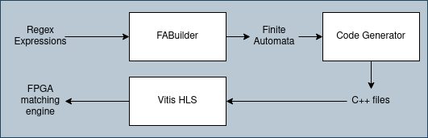

# HLS C++ Regex Compiler

[Old java version][https://github.com/ZeD4805/PCREtoFAtoCPP]

This project is a compiler that turns a file of PCRE expressions and turns it into a C++ header and source files that describe an engine to match the text to the regular expressions. This engine is then put through a HLS tool (Vitis HLS) to get an FPGA bitstream of the engine.

This project was done for my master's thesis, which can be watched in the following link: [Presentation](https://youtu.be/dNqrWZAVnhs).

# Project flow



The project is divided into 2 parts: The FABuilder and the Code Generator.

# Usage

A file must be provided with the regex rules to generate the files from. A file prefix is also asked in order to generate the following files: [prefix].hpp and [prefix].cpp

Example usage:
```go
    import (
        "fmt"
        "thesisGoRemake/FABuilder/Builder"
        "thesisGoRemake/FABuilder/Builder/CharSet"
        "thesisGoRemake/FABuilder/DOT"
    )
    
    func main()  {
        Builder.GenerateFromFile("ExampleFile.txt", "RegexEngine")
    }    
```

# FABuilder

The FABuilder creates a DFA representation of each of the regular expressions. This is done by using a tree walker provided by the ANTLR4 parser+lexer of the provided ruleset to create a graph representation of the DFA.

The building of the DFA is done by entering certain rules of the language in a depth first fashion. Certain rules trigger a creation of segments of graphs while other rules join them together to form the expression. The resulting FA is not a DFA and an extra process must be done to transform it into a DFA.

The construction is based on the Thompson construction method, with some extensions in regard to numbered quantifiers (e.g. "a{3,6}"), back-references... which would be too cumbersome to expand, or impossible to represent in the traditional form.

The construction method internally creates epsilon transitions (no character transitions) which are solved in certain rule triggers.

The final result of the construction is a deterministic FA that represents a regular expression.

## Enforcing Determinism

To provide determinism to the FA, a process that creates intermediate vertices with common characters in a vertices' transitions. This makes it so that a character (and certain conditions) can only lead to a single vertex.

Essentially we travel through the original FA, get any intersections of the outgoing edges of each of the vertices and create a copy version of the FA that is deterministic.


## Numbered Loops

This structure exists as a way to avoid expanding numbered quantifiers. In small cases (e.g. a{3,6}) this structure may not be justified, but for cases with more complex repeated segments and with a higher number of repetitions, the reduced state number and transition number can be advantageous.

This structure has a can have three types, referred to as: exact ({x, x}), bound ({x, y}, x != y), unbound ({x, inf}). Unbound loops can also be represented as an exact loop with an appended asterisk structure (any number of the segment).


## Code Generator

The Code generator works by getting all the vertices of the graph and the transitions and building a C++ engine.

The engine is a function that calls each of the engines and sends back the results of the matching.

# Current state

### Tool part state

| Part           | State              |
|----------------|--------------------|
| FABuilder      | In development     |
| Code Generator | Not in development |

### FABuilder development state

| Builder Features     | State              |
|----------------------|--------------------|
| Basic construction   | Done               |
| Back-references      | In development     |
| Numbered loops       | Done               |
| Determinism Enforcer | Done               |

### Code Generator development state

| Code Generator Features     | State              |
|----------------------|--------------------|
| Not in development   | Not in development|
